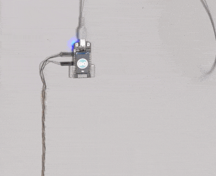

# esp32-ttgo-parking-sensor

Shows when to stop when parking in your garage using a distance sensor and the TTGO display.



## Hardware

- TTGO T-Display ESP32 1.14 Inch Wifi Module
- HC-SR04 ultrasonic sensor (distance)

## Setup

- Arduino project dir is `src/parking`
- Install TFT_eSPI Arduino lib
- Edit `Arduino/libraries/TFT_eSPI/User_Setup_Select.h`

```c
/* Comment out line ~30 */
//#include <User_Setup.h>

/* Uncomment line ~61 */
#include <User_Setups/Setup25_TTGO_T_Display.h>
```

- Update some settings in `parking.ino`
- Upload sketch.

## Helpful links

- TFT_eSPI https://github.com/Bodmer/TFT_eSPI
- HC-SR04 setup https://randomnerdtutorials.com/esp32-hc-sr04-ultrasonic-arduino
- Images generated with http://www.rinkydinkelectronics.com/t_imageconverter565.php

## TODO

- Vehicle presence MQTT/HTTP for HomeAssistant.
